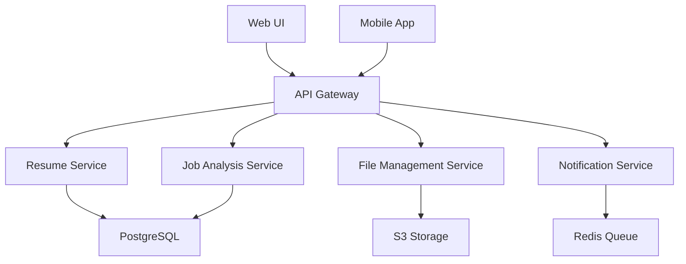
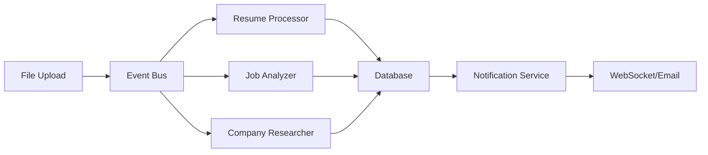
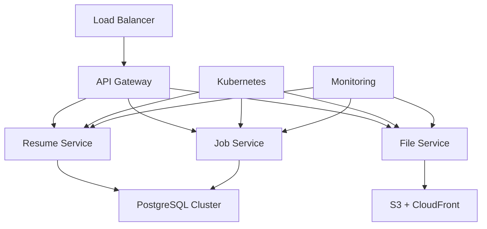

# Architecture Analysis & Scalability Assessment

## Current Architecture Overview

### Strengths ✅

1. **Clean Separation of Concerns**

   - CrewAI agents handle specific tasks
   - FastAPI provides RESTful API
   - Streamlit offers user interface
   - Docker ensures consistent deployment

2. **Good Data Flow**

   - File upload → Knowledge base → Agent processing → Output generation
   - S3 integration for cloud storage
   - Structured output with Pydantic models

3. **Comprehensive Testing**
   - Unit tests for individual components
   - Integration tests for end-to-end flows
   - Mock-based testing for external dependencies

### Scalability Bottlenecks 🚨

#### 1. **Synchronous Processing**

```python
# Current: Blocking operation
result = crew_instance.crew().kickoff(inputs={...})
```

**Issues:**

- Long-running operations block API responses
- No progress tracking for users
- Resource contention under load
- Poor user experience

#### 2. **In-Memory State Management**

```python
# Current: Global dictionary
job_status: Dict[str, Dict[str, Any]] = {}
```

**Issues:**

- Not scalable across multiple instances
- Data loss on service restart
- No persistence or backup
- Race conditions in concurrent access

#### 3. **File System Dependencies**

```python
# Current: Local file operations
output_dir = project_root / 'output' / f"run-{job_id}"
```

**Issues:**

- Not suitable for distributed systems
- No file versioning or cleanup
- Storage limitations
- Backup and recovery challenges

#### 4. **Monolithic Service Design**

**Issues:**

- All functionality in single service
- Difficult to scale individual components
- Tight coupling between modules
- Single point of failure

#### 5. **Limited Error Handling**

**Issues:**

- Basic exception handling
- No retry mechanisms
- No circuit breaker patterns
- Poor error recovery

## Recommended Architecture Evolution

### Phase 1: Microservices Decomposition



### Phase 2: Event-Driven Architecture



### Phase 3: Cloud-Native Architecture



## Performance Optimization Strategies

### 1. **Caching Implementation**

```python
# Redis-based caching
@cache(ttl=3600)  # 1 hour cache
def analyze_job_description(job_url: str) -> JobRequirements:
    # Expensive LLM call cached
    pass

# Application-level caching
@lru_cache(maxsize=1000)
def get_company_info(company_name: str) -> CompanyResearch:
    # Frequently accessed data cached
    pass
```

### 2. **Database Optimization**

```sql
-- Indexes for common queries
CREATE INDEX idx_job_status ON jobs(status);
CREATE INDEX idx_user_jobs ON jobs(user_id, created_at);
CREATE INDEX idx_file_hash ON files(hash);

-- Partitioning for large tables
CREATE TABLE job_results_2024 PARTITION OF job_results
FOR VALUES FROM ('2024-01-01') TO ('2025-01-01');
```

### 3. **Async Processing**

```python
# Celery task queue
@celery.task(bind=True)
def process_resume_optimization(self, job_id: str, job_url: str):
    # Long-running task in background
    self.update_state(state='PROGRESS', meta={'progress': 50})
    # Process resume...
    return {'status': 'completed', 'result': result}
```

### 4. **Resource Management**

```yaml
# Kubernetes resource limits
resources:
  requests:
    memory: "512Mi"
    cpu: "250m"
  limits:
    memory: "2Gi"
    cpu: "1000m"
```

## Security Considerations

### 1. **Authentication & Authorization**

```python
# JWT-based authentication
@require_auth
async def optimize_resume(request: ResumeRequest, current_user: User):
    # Verify user permissions
    if not current_user.can_optimize_resume():
        raise HTTPException(403, "Insufficient permissions")
```

### 2. **Input Validation**

```python
# Pydantic models with validation
class ResumeRequest(BaseModel):
    job_url: HttpUrl
    company_name: Optional[str] = Field(max_length=100)
    file_id: UUID

    @validator('job_url')
    def validate_job_url(cls, v):
        if not v.hostname.endswith(('.com', '.org', '.net')):
            raise ValueError('Invalid job URL domain')
        return v
```

### 3. **Data Encryption**

```python
# Encrypt sensitive data
from cryptography.fernet import Fernet

def encrypt_file(file_content: bytes) -> bytes:
    key = os.getenv('ENCRYPTION_KEY')
    f = Fernet(key)
    return f.encrypt(file_content)
```

## Monitoring & Observability

### 1. **Metrics Collection**

```python
# Prometheus metrics
from prometheus_client import Counter, Histogram, Gauge

REQUEST_COUNT = Counter('api_requests_total', 'Total API requests', ['method', 'endpoint'])
REQUEST_DURATION = Histogram('api_request_duration_seconds', 'API request duration')
ACTIVE_JOBS = Gauge('active_jobs', 'Number of active optimization jobs')
```

### 2. **Distributed Tracing**

```python
# OpenTelemetry tracing
from opentelemetry import trace

tracer = trace.get_tracer(__name__)

@tracer.start_as_current_span("optimize_resume")
def optimize_resume(job_id: str):
    # Traced operation
    pass
```

### 3. **Health Checks**

```python
# Comprehensive health checks
@app.get("/health")
async def health_check():
    checks = {
        'database': await check_database_connection(),
        'redis': await check_redis_connection(),
        's3': await check_s3_connection(),
        'llm_api': await check_llm_api_connection()
    }
    return {'status': 'healthy' if all(checks.values()) else 'unhealthy', 'checks': checks}
```

## Cost Optimization

### 1. **Resource Right-sizing**

- Monitor actual usage patterns
- Implement auto-scaling based on demand
- Use spot instances for non-critical workloads
- Implement resource quotas per user

### 2. **Caching Strategy**

- Cache LLM responses for similar requests
- Implement CDN for static assets
- Use database query result caching
- Cache user session data

### 3. **Efficient Processing**

- Batch similar operations
- Implement request deduplication
- Use async processing for I/O operations
- Optimize database queries

This analysis provides the foundation for transforming your project into an enterprise-ready solution!
